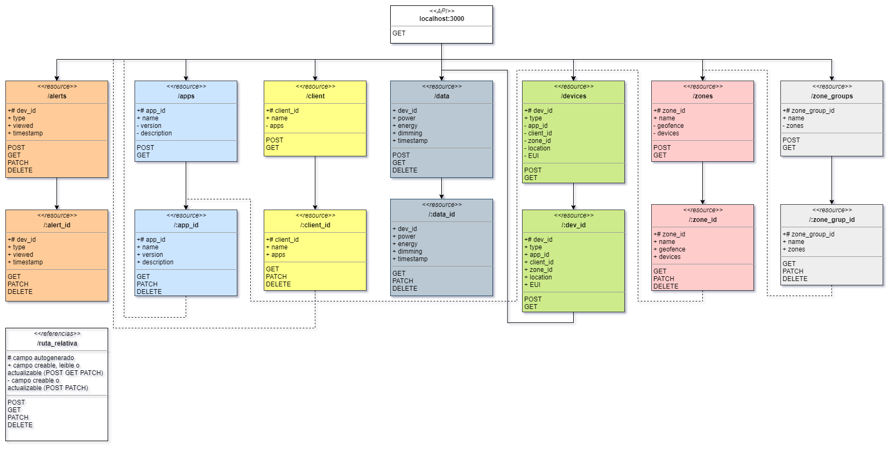
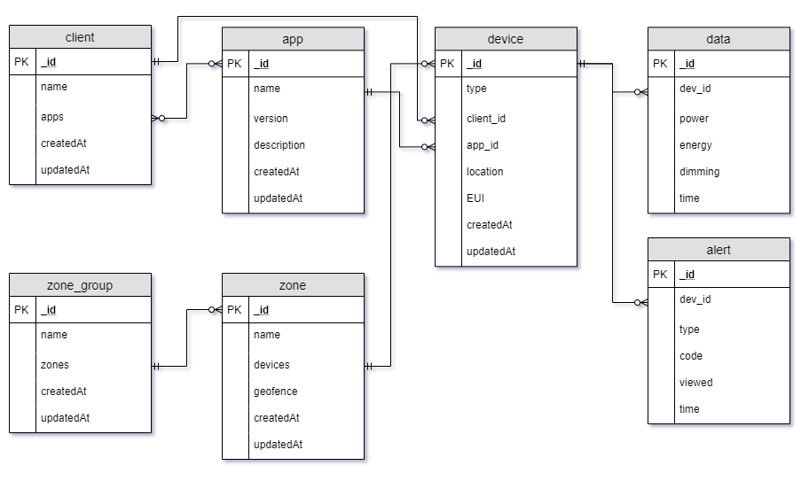

# API Database-Manager
Api de gestion de base de datos no relacional con MongoDB

## Diagrama de la base de datos
[Diagrama en Draw.io](https://drive.google.com/open?id=1u5LbG2TDpZxJ1mV_xK9yqIVYprTJaYVy)

## Documentacion con Swagger
Para acceder a la documentacion interactiva realizada con Swagger siga los siguientes pasos:

1. Abra [Swagger Editor online](https://editor.swagger.io/).
2. Borre todo el contenido del editor entrando a *File > Clear editor*.
3. Copie todo el contenido del archivo [docs/openapi/openapi.yaml](docs/openapi/openapi.yaml) y peguelo en el Swagger editor.
4. A la derecha aparecera la lista de metodos que acepta la API junto con la descripcion de sus parametros y sus posibles respuestas.

<!-- ## Diagrama de rutas

## Base de datos
 -->
